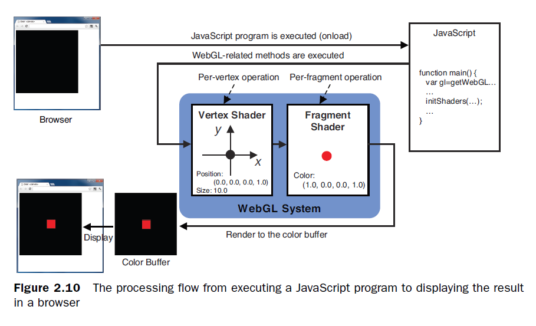
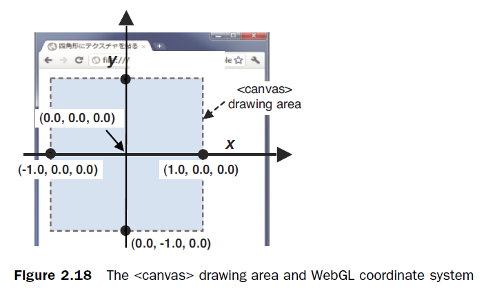

# 使用webGL的第一步

- WebGL如何使用`canvas`以及如何在其上作图
- 使用Javascript连接HTML和WebGL
- 简单的WebGL画图函数使用
- 着色器程序(`shader` programs)在WebGL所处的角色

## 什么是Canvas？

HTML5引入canvas元素用来进行2d和3d作图。2d作图示例见[红色矩形](02rectangle.html)。

### 纯色填充

示例程序见：[纯色填色](01hellocanvas.html)。

1. 获取canvas元素
2. 通过canvas获取其上的WebGL上下文(context)
3. 设置填充(clear)的颜色
4. 填充(clear)颜色

### 描点程序(第一个版本)

示例程序见：[描点程序(第一个版本)](03hellopoint1.html)。

#### 什么是着色器？

WebGL系统中着色器分两种：一种顶点着色器(Vertext Shader)，另一种是片段着色器(Fragment Shader)。编程语言为`GLSL ES`。

- 顶点着色器：用来描述图形的位置和关系(顶点的性质，图形相交等)
- 片段着色器：用来描述图形的光照、像素等其他特性



从这个示例我们可以总结出一般的WebGL程序的流程：

1. 获取canvas元素
2. 从canvas上获取WebGL上下文
3. 初始化着色器
4. 清除颜色
5. 清楚canvas
6. 作图

下面简单给出两种着色器程序的内置变量，详细介绍可参见[官方文档](https://www.khronos.org/opengl/wiki/Built-in_Variable_(GLSL))。

顶点着色器程序的内置特性变量

| 类型 | 变量名称 | 默认值 | 描述 |
| ---- | ---- | ---- | ---- |
| vec4 | gl_Position | 必填 | 指定一个顶点的位置 |
| float | gl_PointSize | 1.0 | 指定一个点的大小(按像素) |

片段着色器程序的内置变量

| 类型 | 变量名称 | 默认值 | 描述 |
| ---- | ---- | ---- | ---- |
| vec4 | gl_FragColor | 必填 | 指定片段的RGBA颜色 |

注：如上的内置变量，可以通过特性变量通过JS把值传入给着色器程序。例如：

```glsl
attribute vec4 a_Position;
void main() {
    gl_Position = a_Position;
    ...
}
```
```javascript
gl.vertexAttrib3f(a_Position, 0.0, 0.0, 0.0); // 给特性变量赋值
var a_Position = gl.getAttribLocation(gl.program, 'a_Position'); //获取特性变量的值
```


WebGL顶点坐标与canvas位置的关系见下图，图中的坐标为顶点坐标。


