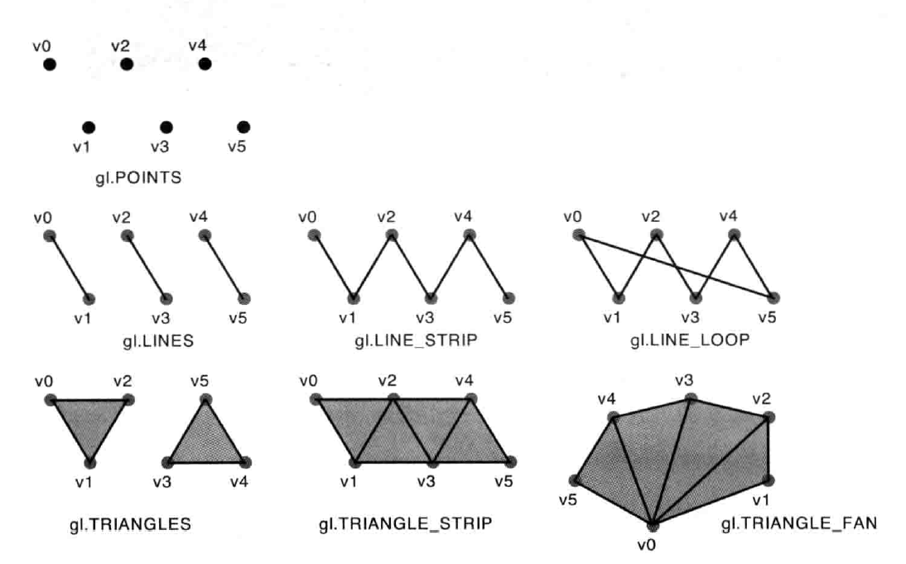

# 绘制和变换三角形

## 绘制多点

[多点绘制](01multipoints.html)

## 绘制类型

| 基本图形 | 参数mode | 描述 |
| ---- | ---- | ---- |
| 点 | gl.POINTS | v0,v1,v2,v3,... |
| 线 | gl.LINES | (v0,v1),(v2,v3),... |
| 线条 | gl.LINE_STRIP | (v0,v1),(v1,v2),(v2,v3),... |
| 线回路 | gl.LINE_LOOP | (v0,v1),(v1,v2),...(vn,v0) |
| 三角形 | gl.TRIANGLES | (v0,v1,v2),(v3,v4,v5),... |
| 三角带 | gl.TRIANGLE_STRIP | (v0,v1,v2),(v2,v1,v3),(v2,v3,v4),...（保持逆时针） |
| 三角扇 | gl.TRIANGLE_FAN | (v0,v1,v2), (v0,v2,v3),(v0,v3,v4),... |

