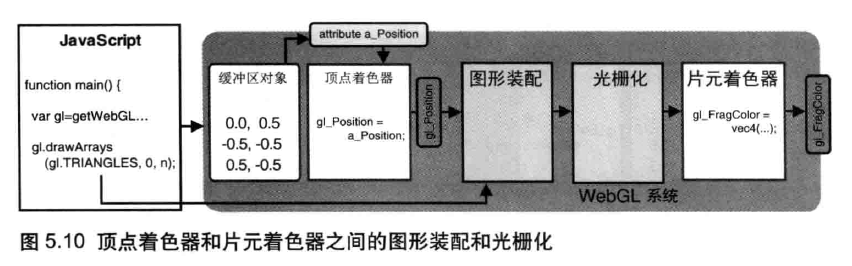

# 颜色和纹理

## 非坐标数据与顶点着色器

- [使用gl_PointSize](01pntsizes.html)
- [交错数据(顶点和点尺寸)使用同一个缓冲器](01pntsizes.html)

gl.vertexAttribPointer(location, size, type, normalized, stride, offset)

- location：指定待分配attribute变量的存储位置
- size：指定缓冲区中每个顶点的分量个数(1->4)
- type：指定数据格式（如，gl.FLOAT）
- normalize：true或者false，表明是否将非浮点型的数据归一化到[0,1]或者[-1,1]
- stride：指定相邻两个顶点间的字节数，默认为0
- offset：指定缓冲区对象中的偏移量（以字节为单位），即attribute变量从缓冲区中的何处开始存储。若从起始位置开始，该参数应设为0

## 颜色

[varying变量，彩色三角形](03pntcolors.html)

顶点着色器和片元着色器之间还有两个步骤：

1. 图形装配过程(The geometric shape assembly process)：将孤立的顶点坐标(`a_Position`)装配成几何图形`gl.drawArrays`
2. 光栅化过程(The rasterization process)：将装配好的几何图形转化为片元

注：几何图形装配过程又被称为图元装配过程(primitive assembly process)

## 图像纹理

1. 准备好映射到几何图形上的纹理图像
2. 为几何图形配置纹理映射方式
3. 加载纹理图像，对其进行一些配置
4. 在片元着色器中将相应的纹素(texels, texture elements)从纹理中抽取出来，并将纹素的颜色赋给片元

### 单个图像贴图

[纹理贴图](05texturecoords.html)

### 多个图像贴图

[多个图像纹理贴图](06texturecoords.html)